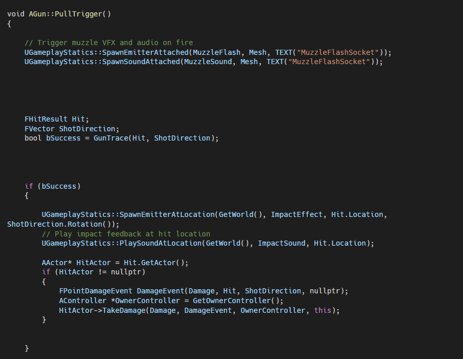

# UnrealShooterGame
Third-Person Shooter — Unreal Engine 5.4

## Overview
Gameplay prototype developed in Unreal Engine 5.4 exploring C++ gameplay systems, Blueprint integration, AI behaviour, and event-driven implementation workflows. The project demonstrates engine-level understanding relevant to interactive gameplay and audio integration.

---

## Audio Integration Example

Gameplay-triggered audio implemented directly in C++.

Weapon firing and impact events trigger sound playback using Unreal Engine gameplay logic (`SpawnSoundAttached` and `PlaySoundAtLocation`), demonstrating how audio connects to runtime gameplay systems.

---

## Skills & Systems Implemented

- **C++ Gameplay Programming** — Shooting mechanics, damage handling, and line tracing.
- **Blueprint Integration** — Connected C++ classes with Blueprint logic for gameplay and feedback systems.
- **Enhanced Input System** — Implemented modern Unreal input mapping workflows.
- **Camera Systems** — Developed gameplay camera behaviours and perspectives.
- **Animation Systems** — Animation Blueprints, Blend Spaces, and State Machines.
- **Combat Mechanics** — Impact detection, VFX spawning, and gameplay-triggered audio.
- **AI Behaviour** — NavMesh navigation with Behaviour Trees and Blackboard tasks.
- **Game State Management** — Win and lose conditions via custom Game Mode logic.
- **Audio Integration** — Sound playback using Unreal Audio Engine and Sound Cues.
- **UI Development** — HUD, reticles, widgets, and health bars.
- **Version Control** — Unreal project management using Git and VSCode.
- **Unreal Standards** — Applied Unreal naming conventions and project organization.

---

## Technical Focus
This project demonstrates understanding of gameplay systems and engine workflows supporting interactive audio implementation.
